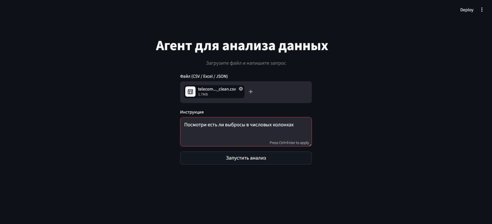
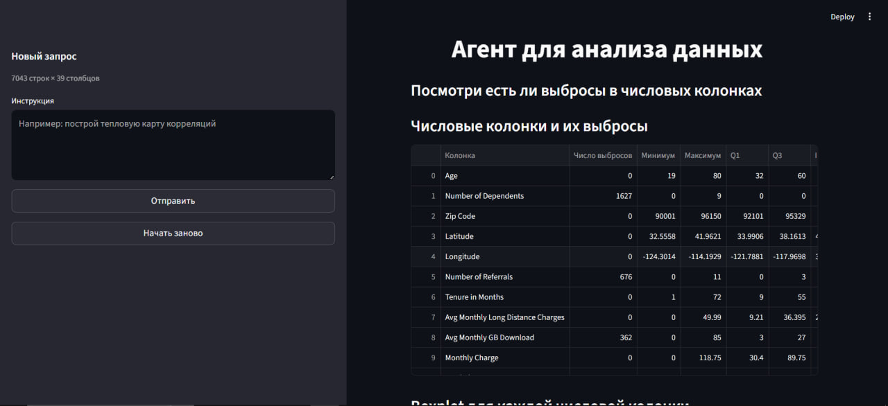
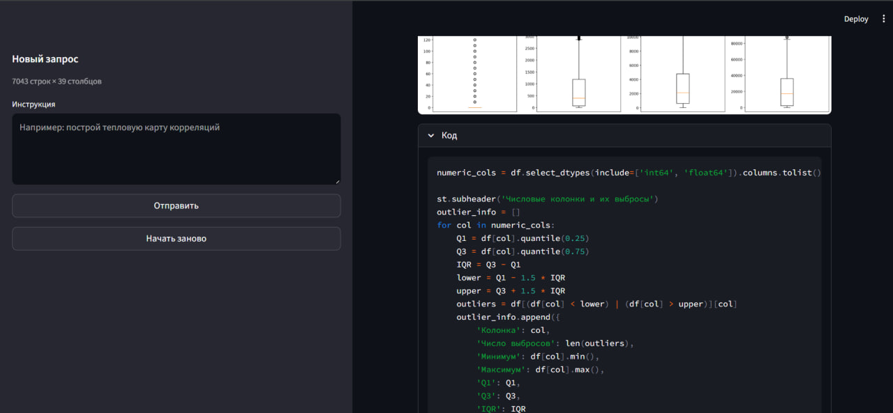
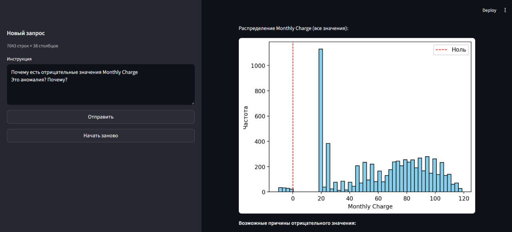
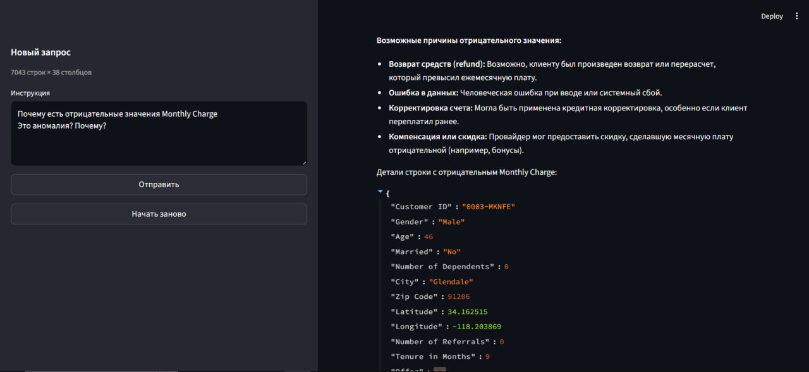

# Агент для анализа данных

Веб-приложение на Streamlit, которое принимает датасет и анализирует его с помощью LLM. Модель сама пишет Python-код, код выполняется и результат отображается прямо в интерфейсе.

## Алгоритм работы

1. Пользователь загружает файл и пишет инструкцию
2. LLM получает осноыную информацию о датасете (размер, колонки, первые строки) и инструкцию
3. LLM возвращает Python-код, который использует `st.*` для вывода результатов
4. Код проверяется на безопасность и синтаксис, затем выполняется через `exec`
5. Пользователь может задавать уточняющие вопросы — LLM помнит контекст всего сеанса

## Установка и запуск

```bash
pip install requirements.txt
streamlit run app.py
```

Токен хранится в `st.secrets`. Необходимо локально создать папку `.streamlit` и там создать файл `secrets.toml`:

```toml
HF_TOKEN = "hf_ваш_токен"
```

## Структура проекта

```
app.py             # всё приложение
requirements.txt   # файл с зависимостями
README.md
```

## Используемые технологии

- **Streamlit** — веб-интерфейс
- **DeepSeek-V3** через HuggingFace Inference API — языковая модель
- **pandas** — работа с датасетами
- **matplotlib** — графики
- **numpy** — статистические показатели

## Защита от prompt injection

Перед выполнением каждый блок кода проверяется на наличие запрещённых паттернов: `os`, `subprocess`, `open()`, `socket`, `eval`, `exec`, `__import__`, а также типичных фраз для инъекций на русском и английском языках. Код с запрещёнными паттернами не выполняется.

## Поддерживаемые форматы файлов

CSV, Excel (.xlsx), JSON

## Пример работы

Начальный экран


Результат работы агента


В конце каждого ответа можно посмотреть код, написанный агентом


Агент может рисовать графики


Также агент может отвечать на вопросы и давать инсайты
